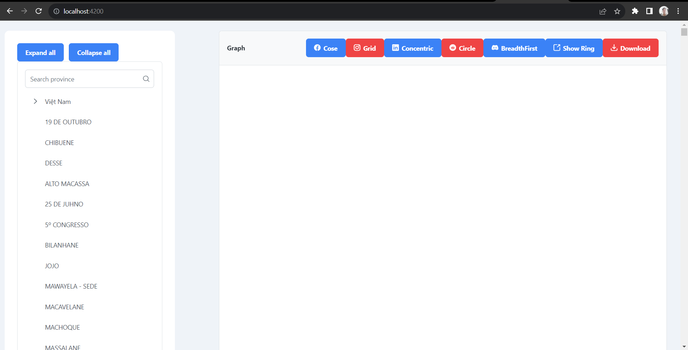
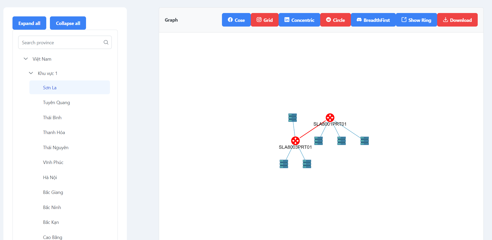
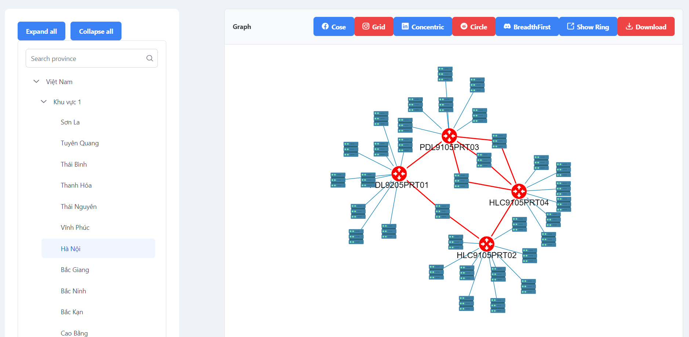
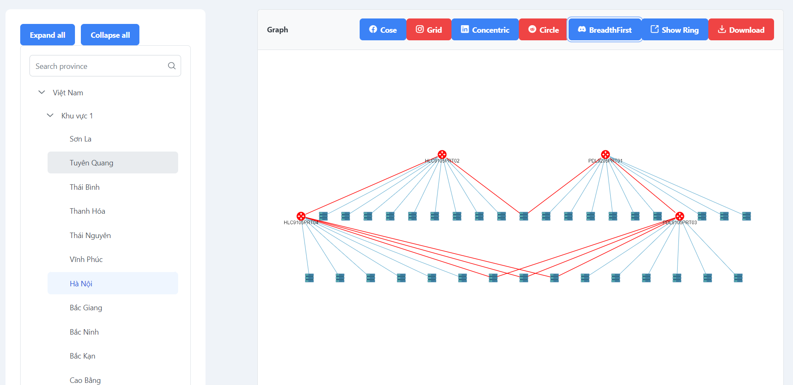
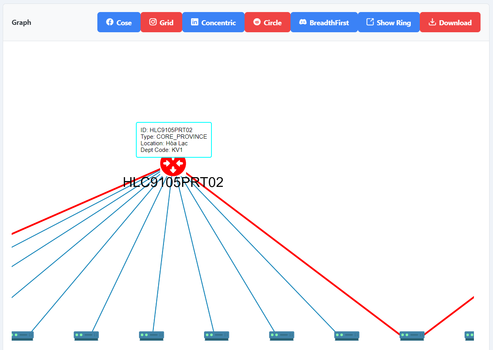
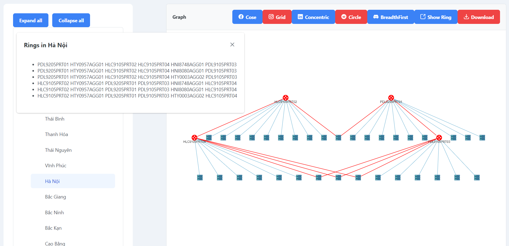

# NIMS
 My task is to rebuild the NIMS project of viettel network at the most basic level

### 1. About the framework used 

#### BackEnd 
**Nestjs 10.1.10** + **MySQL 8.0**

#### FrontEnd
**Angular 16.1.5** + **Cytoscape 3.25.0**

### 2. Installing
*Surely, you have to clone this project to your local server*

#### 2.0 NodeJs, MySQL and Generate Data 
- Install `NodeJs`, `npm` and MySQL
- node v18.16.0
- npm v9.5.1
- MySQL v8.0
- Generate Data by run all SQL scripts in `api/dataGenerate`

#### 2.1 BackEnd 
- Please re-configure your `.env` with your Database setting,  
- Run `npm install` 
- Run `npm run start`

#### 2.2 FrontEnd
- Run `npm install`
- Run `npm run start`

### 3. Description

- In backend site, nestjs will collect the data from MySQL server.
- In frontend site, angular request data for building graph and other features.

### 4. Key features

Home Page

Default layout of topology in an Area
 

CoSE layout in Ha Noi

Breadth First (BFS) layout in Ha Noi

Zoom in a node in topology 

Show ring in an area
